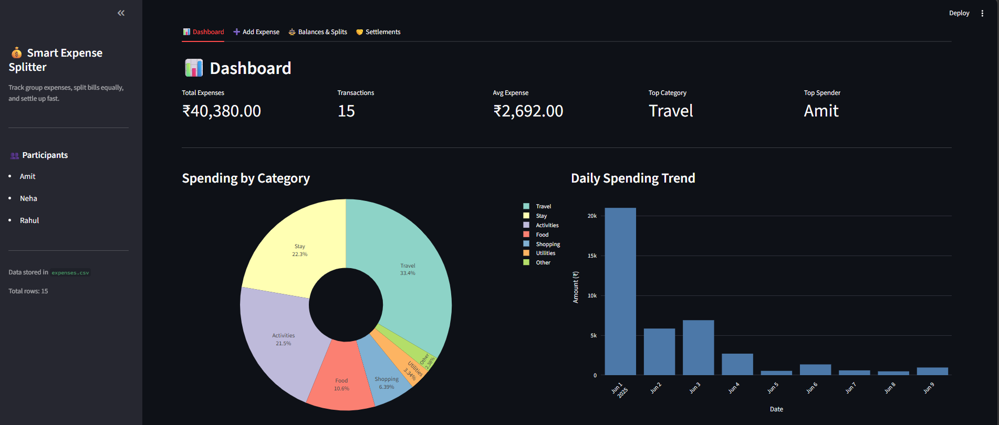

# Smart Expense Splitter & Analytics Dashboard

A Python and Streamlit application for recording shared expenses, splitting bills equally, calculating balances, and exploring spending patterns. Designed as a small internship/demo project for trips, roommates, and groups of friends.

All application logic and internal tests live in **`app.py`**. Expenses are stored in a local CSV file, with interactive charts built using Plotly.

## Application UI

### Dashboard tab

The Dashboard is the first screen you see when the app loads. It shows five KPI cards at the top, followed by two charts side by side, and a full-width bar chart below.



**What the dashboard shows with the sample dataset:**

| KPI | Value |
| --- | --- |
| Total Expenses | ₹40,380.00 |
| Transactions | 15 |
| Avg Expense | ₹2,692.00 |
| Top Category | Travel |
| Top Spender | Amit |

- **Spending by Category** — donut pie chart with percentage labels for all 7 categories
- **Daily Spending Trend** — bar chart showing spending per day from Jun 1–9, 2025
- **Amount Paid by Each Person** — horizontal bar chart comparing Amit, Neha, and Rahul
- **Insights** — 3 auto-generated plain-English lines summarising the data (highest category, biggest payer, average expense)

---

### Add Expense tab

A form with 6 fields. All fields are validated before saving.

| Field | Type | Example |
| --- | --- | --- |
| Date | Date picker | 2025-06-10 |
| Description | Text input | Lunch at cafe |
| Category | Dropdown | Food |
| Amount (₹) | Number input (min 0.01) | 750.00 |
| Paid By | Dropdown (from participants) | Amit |
| Split Between | Multi-select | Amit, Neha, Rahul |

Clicking **Save Expense** appends the row to `expenses.csv` and refreshes the dashboard immediately. Empty descriptions, zero/negative amounts, and no participants selected are each blocked with an error message.

---

### Balances & Splits tab

Shows a colour-coded table of each person's financial position.

| Person | Total Paid | Total Share | Net Balance |
| --- | ---: | ---: | ---: |
| Amit | ₹20,100.00 | ₹12,610.00 | **+₹7,490.00** 🟢 |
| Neha | ₹14,220.00 | ₹14,410.00 | **−₹190.00** 🔴 |
| Rahul | ₹6,060.00 | ₹13,360.00 | **−₹7,300.00** 🔴 |

Green = should receive money. Red = owes money. The full expense list is shown below the balance table.

---

### Settlements tab

Shows the minimum transactions needed to clear all debts:

```
💸 Rahul pays Amit  →  ₹7,300.00
💸 Neha  pays Amit  →  ₹190.00
```

A verification check confirms that applying these payments brings every balance to zero.

---

## Features

| Area | What it provides |
| --- | --- |
| Dashboard | Total expenses, transaction count, average expense, top category, and top payer |
| Spending analysis | Category distribution, daily spending trend, and individual contributions |
| Add Expense | Date, description, category, amount, payer, and participants sharing the expense |
| Equal splitting | Each expense is shared among its selected participants |
| Balances & Splits | Total paid, total share, and net balance for each participant |
| Settlements | Suggested payments using greedy debtor/creditor matching, plus a verification check |
| CSV storage | Expenses are appended to `expenses.csv` beside the application |
| Validation | Required description, positive amount, and at least one participant |
| Participants | Names derived from existing data; Amit, Neha, and Rahul used for an empty dataset |

Categories: **Food, Travel, Stay, Activities, Shopping, Utilities, Other**.

## Technology

- **Python 3.12** — verified local runtime
- **Streamlit** — web interface
- **Pandas** — data loading, aggregation, and styled tables
- **Plotly Express** — interactive charts
- **Jinja2** — Pandas table styling dependency
- **CSV** — local storage without a database

Dependency ranges are listed in `requirements.txt`. The app was verified with Streamlit 1.64.0, Pandas 3.0.6, Plotly 7.1.0, and Jinja2 3.1.6. Other allowed dependency combinations have not all been tested.

## Quick start

### 1. Clone the repository

```powershell
git clone https://github.com/Abhinav-mkr/Smart_Expense_Splitter.git
cd Smart_Expense_Splitter
```

If you downloaded a ZIP, extract it and open a terminal inside the extracted project folder instead.

### 2. Create an environment and install dependencies

On Windows with Python 3.12 installed:

```powershell
py -3.12 -m venv .venv
.\.venv\Scripts\python.exe -m pip install -r requirements.txt
```

These commands use the environment directly, so PowerShell activation is not required.

On macOS or Linux with Python 3.12 installed:

```bash
python3.12 -m venv .venv
.venv/bin/python -m pip install -r requirements.txt
```

### 3. Launch the app

Windows:

```powershell
.\.venv\Scripts\python.exe -m streamlit run app.py
```

macOS/Linux:

```bash
.venv/bin/python -m streamlit run app.py
```

Open the local URL printed in the terminal, normally **http://localhost:8501**. Keep that terminal running while using the app; press **Ctrl+C** to stop it.

For the existing Windows setup where dependencies are already installed:

```powershell
py -3.12 -m streamlit run app.py
```

## Using the app

1. Open **Dashboard** to review the sample data and spending charts.
2. Open **Add Expense**, enter a description and amount, select who paid and who shares the expense, and save.
3. Review **Balances & Splits** to see each person's contributions and share.
4. Open **Settlements** to see suggested payments and whether they clear the calculated balances.

The app suggests payments; it does not send money or record completed settlement payments. New participant names currently need to be introduced through the CSV; there is no separate participant-management screen.

## Included sample dataset

The repository includes the original **15 expenses totaling ₹40,380**, dated **June 1–9, 2025**, for **Amit, Neha, and Rahul**. All seven categories are represented.

| Sample metric | Value |
| --- | --- |
| Total expenses | ₹40,380.00 |
| Transactions | 15 |
| Average expense | ₹2,692.00 |
| Highest spending category | Travel — ₹13,500.00 |
| Highest payer | Amit — ₹20,100.00 |

Expected balances for the included dataset:

| Participant | Total paid | Total share | Net balance |
| --- | ---: | ---: | ---: |
| Amit | ₹20,100.00 | ₹12,610.00 | +₹7,490.00 |
| Neha | ₹14,220.00 | ₹14,410.00 | −₹190.00 |
| Rahul | ₹6,060.00 | ₹13,360.00 | −₹7,300.00 |

Suggested sample settlements: **Rahul pays Amit ₹7,300**, and **Neha pays Amit ₹190**.

## CSV format and storage

`expenses.csv` must be a plain-text CSV file, rather than an Excel workbook renamed to `.csv`.

```csv
date,description,category,amount,paid_by,split_between
2025-06-01,Flight tickets to Goa,Travel,12000.00,Amit,Amit|Neha|Rahul
```

| Column | Format |
| --- | --- |
| `date` | `YYYY-MM-DD` |
| `description` | Expense description |
| `category` | Expense category |
| `amount` | Numeric amount, stored to two decimal places |
| `paid_by` | Name of the person who paid |
| `split_between` | Participant names separated by `|` |

The app resolves the CSV relative to `app.py`, so launching from another working folder still uses the same dataset. Existing expenses are preserved when a new expense is appended. Missing or empty files show an empty dashboard with default participants. A header-only file does not receive a duplicate header when the first expense is saved.

To start a fresh dataset, first back up `expenses.csv`, then replace its contents with only the header row. This removes the expense rows from the working copy; restore your backup to recover them.

## How calculations work

```text
share per expense = expense amount / number of selected participants
total share = sum of that participant's shares
net balance = total paid - total share
```

- A positive net balance means the person should receive money.
- A negative net balance means the person owes money.
- Settlement suggestions match debtors with creditors using a greedy algorithm.

Shares are rounded to two decimal places for each expense. Amounts that do not divide evenly can therefore leave small rounding differences; the current implementation does not allocate leftover paise. The greedy settlement algorithm produces a practical payment sequence but does not guarantee the globally smallest number of transactions for every possible dataset.

## Project structure

```text
Smart_Expense_Splitter/
├── app.py                          # UI, storage, calculations, analytics, tests
├── expenses.csv                    # Original sample expense dataset
├── requirements.txt                # Python dependencies
├── README.md                       # Setup, usage, architecture, and limitations
├── smart-expense-splitter-plan.md   # Original implementation plan (historical)
├── .gitignore                      # Excludes caches, environments, and secrets
└── .gitattributes                  # Consistent text handling; preserves CSV bytes
```

Within `app.py`, the data layer loads and saves expenses; the calculation layer produces balances and settlement suggestions; the analytics layer computes KPIs and summaries; and the UI layer renders the four Streamlit tabs.

## Tests and verification

Run the built-in tests on Windows:

```powershell
.\.venv\Scripts\python.exe app.py --test
```

Or, with the existing system installation:

```powershell
py -3.12 app.py --test
```

The four internal checks cover equal shares, balanced totals for the test dataset, settlement clearance, and the case where one person pays for everyone. Success ends with `All tests passed.` Test data is held in memory and does not replace `expenses.csv`.

Launch verification also confirmed all four tabs render, three charts and two tables are present, an empty-description submission is blocked, and CSV appending works for missing, empty, and header-only files using temporary test data. The original CSV's SHA-256 checksum remained unchanged.

## Launch fixes included

- Corrected the entry point: Streamlit also executes the script as `__main__`; tests now run only with `--test`.
- Replaced the removed Pandas `Styler.applymap` call with `Styler.map`.
- Replaced deprecated `use_container_width` arguments with `width="stretch"`.
- Resolved `expenses.csv` relative to the application file.
- Fixed duplicate CSV headers when appending to a header-only file.
- Declared dependency ranges and the Jinja2 styling dependency.

## Troubleshooting

| Problem | Action |
| --- | --- |
| `No module named streamlit` | Install `requirements.txt` using the same Python executable used to run the app. |
| `streamlit` command not found | Use `python -m streamlit` with the environment's Python executable, as shown above. |
| Port 8501 is already in use | Reuse the running app or add `--server.port 8502` to the launch command. |
| Empty dashboard despite a populated file | Check the CSV location, six required columns, numeric amounts, and plain-text format. |
| Unexpected participant names | Check spelling and whitespace in `paid_by` and pipe-separated `split_between` values. |

## Current scope and limitations

This is a local demonstration app. It has no authentication, database, email delivery, payment gateway, multiple-group management, currency conversion, or CSV write locking for concurrent users. The currency display is INR.

The current CSV loader returns an empty dataset for several read/format errors and drops unreadable amounts in its conversion step. It does not provide detailed import diagnostics. Duplicate-submission prevention is session-based, not a permanent uniqueness constraint.

The repository contains source code and sample data. Publishing it on GitHub does not deploy a hosted Streamlit app.
